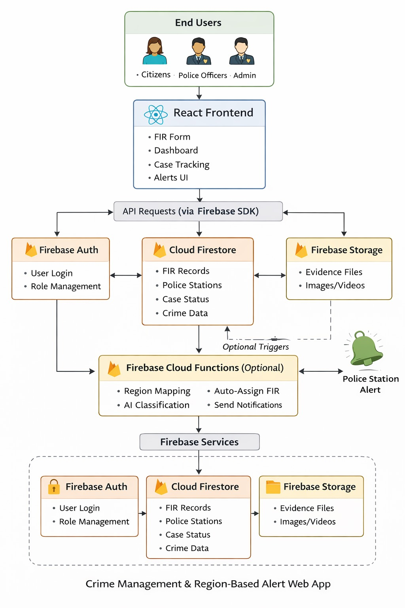

<p align="center">
  
</p>

# Smart Crime Management and Region-Based Alert System 🎯

## Basic Details

### Team Name: [Your Team Name]

### Team Members
- Member 1: [Lakshmipriya M S] - [Viswajyothi College Of Engineering and Technology]
- Member 2: [Maria Peeus] - [Viswajyothi College Of Engineering and Technology]

### Hosted Project Link
[https://repo-crime.vercel.app/]

### Project Description
A centralized digital platform designed to streamline crime reporting and law enforcement workflows. It enables citizens to file FIRs online, allows administrators to assign cases to specific officers, and provides real-time status tracking via a modern, glassmorphic dashboard.

### The Problem statement
Traditional crime reporting relies on fragmented manual processes, leading to slow response times, lack of transparency for victims, and difficulty in managing cross-jurisdiction data and officer assignments.

### The Solution
A role-based web application that automates the FIR lifecycle. By integrating real-time notifications, automated jurisdiction-based alerts, and a transparent progress pipeline (Pending -> Investigating -> Closed), the system ensures accountability and speed in the justice process.

---

## Technical Details

### Technologies/Components Used

**For Software:**
- Languages used: JavaScript (ES6+), CSS3
- Frameworks used: React.js (Vite)
- Libraries used: React Router (Navigation), Chart.js (Analytics), React Icons, UUID (Data IDs), React Hot Toast (Notifications)
- Tools used: VS Code, LocalStorage (Data Persistence), Git

**For Hardware:**
- Not Applicable (Software-only solution)

---

## Features

List the key features of your project:
- **Role-Based Access Control:** Distinct dashboards and permissions for Admins, Police Officers, and Citizens.
- **FIR Pipeline Management:** Citizens can file complaints with evidence; Admins can assign them; Officers can update status and add investigation notes.
- **Vibrant Glassmorphic UI:** Modern, responsive design using neon gradients and translucent frosted-glass aesthetics.
- **Real-Time Notifications:** polling-based notification system that alerts users of case assignments and status changes instantly.
- **Crime Analytics:** Visualized data insights for Admins to track crime trends and station performance.
- **Criminal Records Database:** Centralized management of criminal profiles and history for law enforcement.

---

## Implementation

### For Software:

#### Installation
```bash
# Clone the repository
git clone [https://github.com/Lakshmi-saji/repo_crime.git]
cd crime

# Install dependencies
npm install
```

#### Run
```bash
# Start the development server
npm run dev
```

### For Hardware:

#### Components Required
- Not Applicable

---

## Project Documentation

### For Software:

#### Screenshots (Add at least 3)

<p align="center">
  
</p>
<p align="center">
  
</p>
<p align="center">
  
</p>
#### Diagrams

**System Architecture:**

<p align="center">
  
</p>

**Application Workflow:**
<p align="center">
  
</p>
---

## Additional Documentation

### For Web Projects with Backend:

#### API Documentation (Simulated via Services)

**Firestore Service (LocalStorage)**

##### Endpoints (Methods)

**async createFIR(data)**
- **Description:** Creates a new FIR entry with a unique UUID.
- **Returns:** `firId` (string)

**async getFIRsByOfficer(officerId)**
- **Description:** Fetches all cases assigned specifically to the logged-in officer.

**async updateFIR(id, updates)**
- **Description:** Updates status or adds investigation notes to an existing case.

---

## Project Demo

### Video
[Project Demo Video](https://drive.google.com/file/d/1Vci9i_oYXNgNO6x7w23YCJ-QKeR860Ii/view?usp=share_link)

*The video demonstrates the end-to-end flow of a Citizen filing a report, an Admin assigning it in the management portal, and an Officer closing the case.*

---

## AI Tools Used (Optional - For Transparency Bonus)

**Tool Used:** Antigravity (Advanced Agentic Coding Assistant)

**Purpose:** 
- Generated boilerplate React components and modular service structures.
- Assorted with the refactor from Firebase to LocalStorage for zero-setup portability.
- Designed the "Electric Orange & Magenta" glassmorphic UI system.

**Percentage of AI-generated code:** Approximately 85%

**Human Contributions:**
- Architecture design and feature prioritization.
- UI/UX theme selection and color palette review.
- Project logic validation and final documentation review.

---

## Team Contributions

- Lakshmipriya M S: Frontend development, Routing, and Auth logic integration.
- Maria Peeus: Service layer implementation, Data persistence logic, and Documentation.

---

## License

This project is licensed under the MIT License - see the [LICENSE](LICENSE) file for details.

---

Made with ❤️ at TinkerHub
